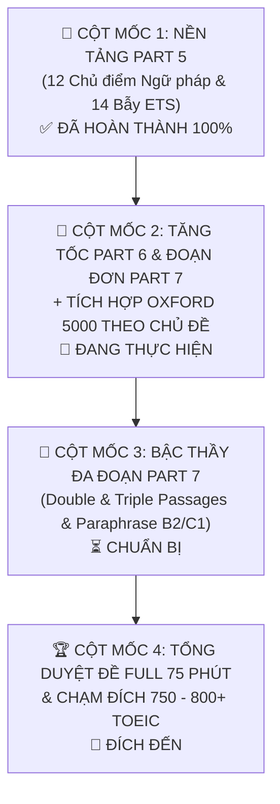

# 🎯 LỘ TRÌNH ÔN THI TOEIC READING BỨT PHÁ (MỤC TIÊU 380 - 420+ READING / TỔNG 750+)

> **ĐÍCH TỚI TỐI THƯỢNG CỦA CHƯƠNG TRÌNH AGENT (THE ULTIMATE DESTINATION):**  
> 1. **Điểm số mục tiêu:** TOEIC Reading $\ge 380 - 420+$ (Tổng điểm $\ge 750 - 800+$).  
> 2. **Vốn từ vựng:** Làm chủ trọn bộ **600 từ vựng cốt lõi TOEIC** + **Kho 5.946 từ & 750 cụm từ Oxford 5000** (tập trung 2.473 từ B1-B2 cốt lõi cho công sở, thương mại, điều hành).  
> 3. **Phản xạ tốc độ chuẩn ETS:**  
>    - **Part 5 (30 câu):** 10 - 12 phút (15-20s/câu, độ chính xác $\ge 26/30$).  
>    - **Part 6 (16 câu):** 8 - 9 phút (30s/câu, độ chính xác $\ge 13/16$).  
>    - **Part 7 (54 câu):** 50 - 53 phút (~50-55s/câu, đọc hiểu định vị thông tin không cần dịch word-by-word).  
> 4. **Trình độ thực tế:** Đạt chuẩn **CEFR B2 (Vantage/Upper-Intermediate)** - Đọc hiểu mượt mà toàn bộ email, hợp đồng, báo cáo tài chính quốc tế.

---

## 🗺️ BẢN ĐỒ 4 CỘT MỐC (4 MILESTONES) & TIẾN ĐỘ HIỆN TẠI

---

## ⏱️ PHÂN BỔ THỜI GIAN "CHUẨN ETS" (TỔNG 75 PHÚT - 100 CÂU)

| Phần thi | Số câu | Thời gian khuyến nghị | Tốc độ chuẩn | Chiến thuật cốt lõi |
| :--- | :--- | :--- | :--- | :--- |
| **Part 5** | 30 câu (101-130) | **10 - 12 phút** | ~20-25s / câu | Nhìn 4 đáp án trước; chia dạng Ngữ pháp vs. Từ vựng. |
| **Part 6** | 16 câu (131-146) | **8 - 10 phút** | ~30s / câu | Đọc lướt theo ngữ cảnh, chú ý câu điền nguyên văn. |
| **Part 7 (Single)** | 29 câu (147-175) | **25 - 28 phút** | ~50s / câu | Đọc câu hỏi trước $\rightarrow$ Quét từ khóa $\rightarrow$ Đối chiếu đoạn văn. |
| **Part 7 (Double/Triple)** | 25 câu (176-200) | **25 - 28 phút** | ~60s / câu | Xác định mối quan hệ giữa 2-3 bài $\rightarrow$ Tìm câu hỏi chéo. |
| **Soát phiếu / Dự phòng** | - | **2 - 3 phút** | - | Kiểm tra không bỏ sót câu nào (Tô kín 100%). |

---

### GIAI ĐOẠN 1: NỀN TẢNG PART 5 (MỤC TIÊU: ĐÚNG $\ge 24/30$ CÂU, 10 PHÚT) - [HOÀN THÀNH 100%]
*Đã hoàn tất toàn bộ lý thuyết 12 chủ điểm & 14 bẫy điểm cá nhân (TRAP-01 đến TRAP-14).*

#### Checklist 12 Chủ điểm ngữ pháp cốt lõi:
- [x] 1. Vị trí Danh từ, Động từ, Tính từ, Trạng từ (Word Forms). *(Đã xong)*
- [x] 2. Đại từ nhân xưng, Đại từ phản thân (*myself/themselves*), Tính từ sở hữu. *(Đã xong)*
- [x] 3. Sự hòa hợp giữa Chủ ngữ và Động từ (Subject-Verb Agreement). *(Đã xong)*
- [x] 4. Thì động từ thông dụng trong công việc (Hiện tại đơn, Hiện tại hoàn thành, Tương lai, Quá khứ đơn). *(Đã xong)*
- [x] 5. Thể Bị động (`be + V3/ed`) và cách phân biệt chủ động/bị động dựa vào tân ngữ. *(Đã xong)*
- [x] 6. Danh động từ ($V\text{-ing}$) và Động từ nguyên mẫu ($to\text{-}V$) + Bẫy Giới từ TO + V-ing. *(Đã xong)*
- [x] 7. Phân từ & Mệnh đề phân từ rút gọn ($V\text{-ing}$ chủ động, $V\text{-ed}$ bị động). *(Đã xong)*
- [x] 8. Liên từ đẳng lập ($and, but, or$) & Liên từ phụ thuộc ($although, because, while...$). *(Đã xong)*
- [x] 9. Phân biệt Liên từ (theo sau là Mệnh đề) và Giới từ (theo sau là Cụm danh từ/V-ing) (*vd: because vs. because of, although vs. despite*). *(Đã xong)*
- [x] 10. Mệnh đề quan hệ ($who, which, that, whose$) và dạng rút gọn ($V\text{-ing}, V\text{-ed}$). *(Đã xong)*
- [x] 11. Cấu trúc so sánh (Bằng, Hơn, Nhất, Càng... càng...) & Phó từ nhấn mạnh. *(Đã xong)*
- [x] 12. Câu điều kiện ($If$ loại 1, 2 và dạng đảo ngữ với Should, Were, Had). *(Đã xong)*

---

### GIAI ĐOẠN 2: TĂNG TỐC PART 6 & ĐỌC HIỂU ĐƠN PART 7 (ĐANG TRIỂN KHAI)
*Thời lượng gợi ý: 3 - 4 tuần*

#### 1. Trọng tâm Part 6 (Điền từ vào đoạn văn hoàn chỉnh):
- [x] Chuyển đổi mô hình: Học từ vựng qua Mạch đoạn văn (Passage Context) & Cây hệ sinh thái thay vì câu đơn Part 5. *(Bắt đầu từ 2026-09-25)*
- [ ] Rèn luyện câu hỏi điền câu nguyên văn (Sentence insertion): Đọc câu phía trước và phía sau chỗ trống để tìm từ nối logic (*However, Therefore, As a result, Furthermore*).
- [ ] Nhận biết thời gian để chia thì xuyên suốt cả văn bản.

#### 2. Trọng tâm Part 7 Đoạn Đơn (Single Passages):
- [ ] Nhận diện thể loại văn bản:
  * **Email / Memo / Letter**: Xác định ngay Người gửi, Người nhận, Tiêu đề (Subject/Re), Mục đích (Thường ở 2 dòng đầu tiên).
  * **Advertisement / Notice / Flyer**: Tìm thông tin điều kiện khuyến mãi, đối tượng tham gia, thời hạn.
  * **Schedule / Agenda / Invoice / Form**: Kỹ năng tra cứu theo cột/hàng, tìm cước phí, giờ giấc, ghi chú chân trang (asterisks `*`).
  * **Chat / Text Message Chains**: Đọc ngữ cảnh nói chuyện của 2-3 người, câu hỏi hỏi ý nghĩa ẩn dụ (*"What does the speaker mean when saying..."*).

---

### GIAI ĐOẠN 3: BẬC THẦY PART 7 ĐA ĐOẠN & BẢN ĐỒ PARAPHRASE
*Thời lượng gợi ý: 2 - 3 tuần*

#### 1. Kỹ thuật giải quyết Double & Triple Passages:
- [ ] **Không đọc hết cả 2-3 bài rồi mới đọc câu hỏi!**
- [ ] Đọc lướt tiêu đề để hiểu mối quan hệ (Bài 1 là thư phàn nàn $\rightarrow$ Bài 2 là email phản hồi $\rightarrow$ Bài 3 là hóa đơn hoàn tiền).
- [ ] Phân loại câu hỏi:
  * Câu hỏi chỉ nằm ở Bài 1 $\rightarrow$ Tìm và giải quyết ngay.
  * Câu hỏi chỉ nằm ở Bài 2 $\rightarrow$ Tìm và giải quyết ngay.
  * **Câu hỏi chéo (Cross-reference)** (thường là câu 3 và 4 của cụm 5 câu): Cần kết hợp thông tin giữa Bài 1 và Bài 2/3 mới suy ra đáp án.

#### 2. Xây dựng phản xạ Paraphrase:
- [ ] Ghi lại mọi cặp từ đồng nghĩa/diễn đạt tương đương vào `vocab_bank/my_vocab.md`.
  * *Ví dụ trong đề:* "postpone the gathering" $\rightarrow$ *Đáp án:* "delay the meeting".
  * *Ví dụ trong đề:* "provide complimentary breakfast" $\rightarrow$ *Đáp án:* "free meal is included".

---

### GIAI ĐOẠN 4: TỔNG DUYỆT ĐỀ 75 PHÚT & BẢO TOÀN ĐIỂM SỐ
*Thời lượng gợi ý: 2 tuần trước khi thi*

- [ ] Luyện trọn vẹn 1 test Reading 75 phút mỗi 2 ngày (bộ ETS 2023 hoặc 2024).
- [ ] Bật chế độ chấm điểm khắt khe, không dùng từ điển trong lúc làm.
- [ ] Dành ít nhất **90 phút sau mỗi test** để dùng `toeic.py` và Agent phân tích tất cả các câu sai.
- [ ] Lọc ra các "bẫy quen thuộc" mà bản thân hay dính phải.

---

## 📌 QUY TẮC "3 KHÔNG" CHO NGƯỜI HỌC TOEIC READING
1. **KHÔNG** làm đề mà không bấm giờ.
2. **KHÔNG** làm xong chỉ đếm số câu đúng rồi chuyển sang đề mới (Học 1 đề hiểu sâu gấp 10 lần làm 10 đề lướt).
3. **KHÔNG** tra từ điển khi đang trong giờ làm bài thi thử.
